## Machine Learning Models

### LDA, QDA and Logistic Model

<a href="https://github.com/mengtzhou/machine-learning-models/blob/main/lda-qda-logistic.ipynb">See Code</a>

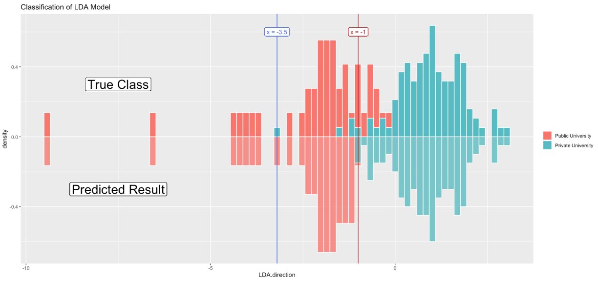
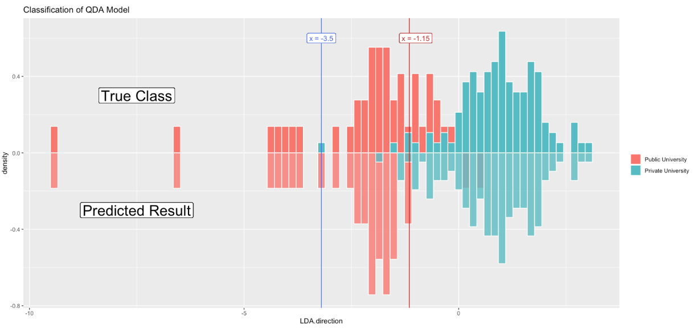
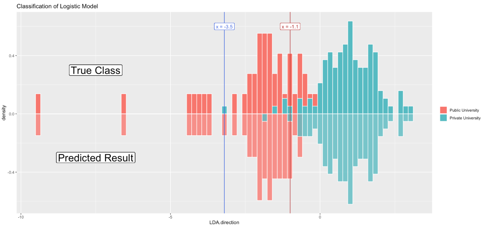
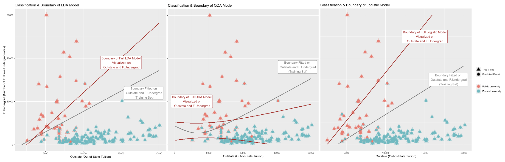

### KNN and Cross Validation

<a href="https://github.com/mengtzhou/machine-learning-models/blob/main/knn-cross-validation.ipynb">See Code</a>

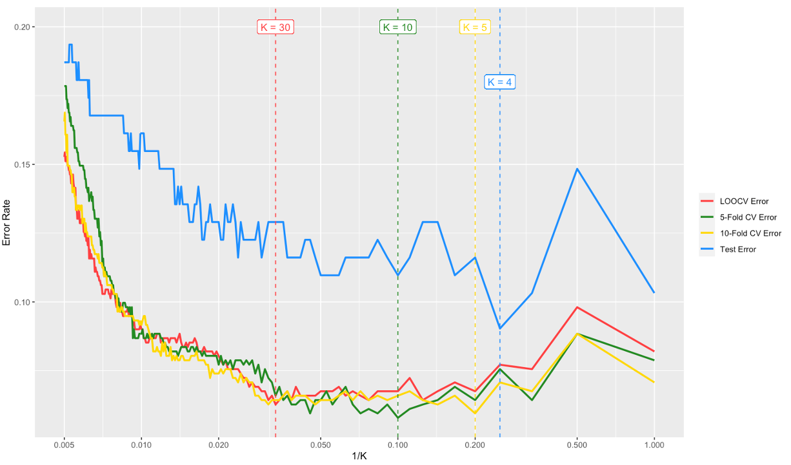

### Tree and Random Forest

<a href="https://github.com/mengtzhou/machine-learning-models/blob/main/tree-rf-ada.ipynb">See Code</a>

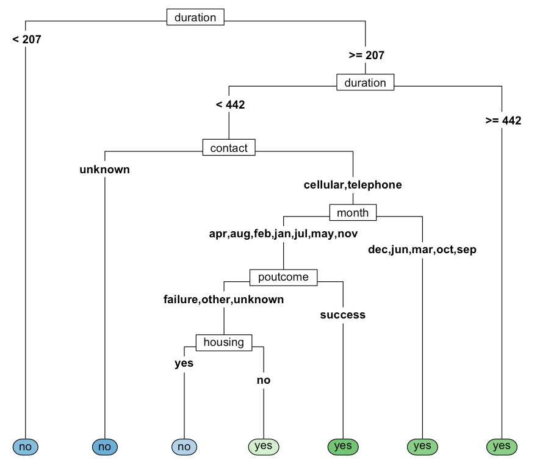
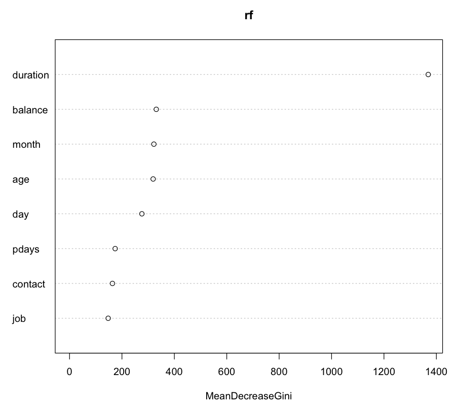
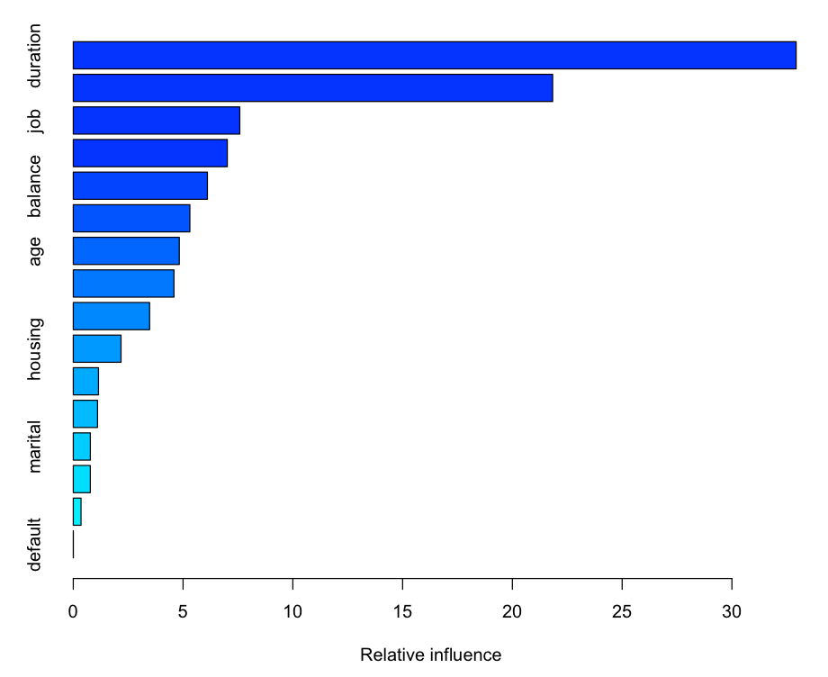

### SVM, MLP and CNN

<a href="https://github.com/mengtzhou/machine-learning-models/blob/main/svm-mlp-cnn.ipynb">See Code</a>

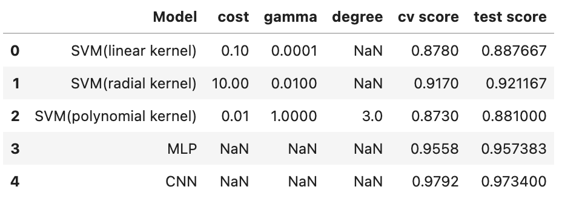

### PCA, MDP and Isomap

<a href="https://github.com/mengtzhou/machine-learning-models/blob/main/pca-mds-isomap.ipynb">See Code</a>

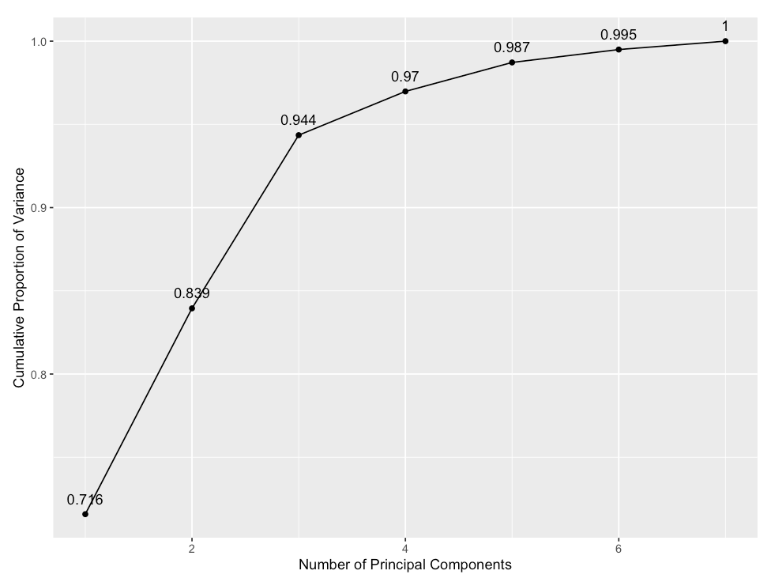
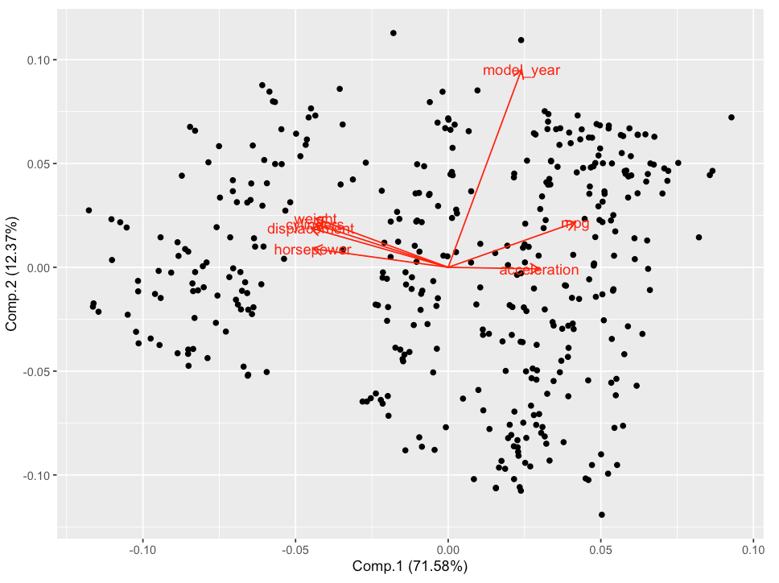
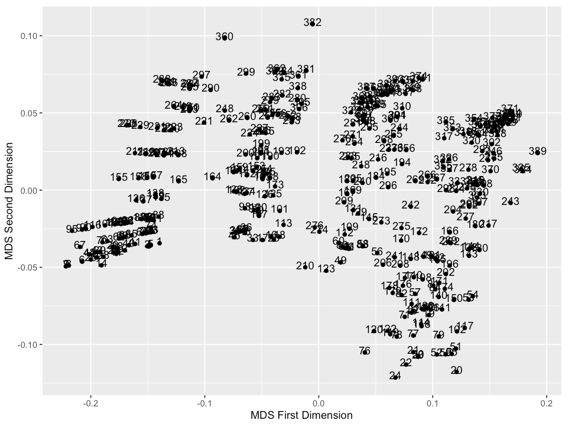
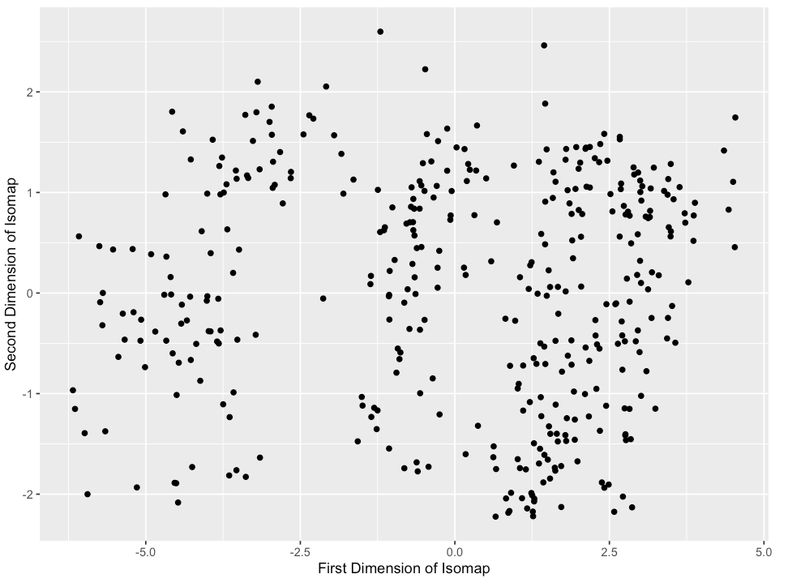

### Clustering

<a href="https://github.com/mengtzhou/machine-learning-models/blob/main/clustering.ipynb">See Code</a>

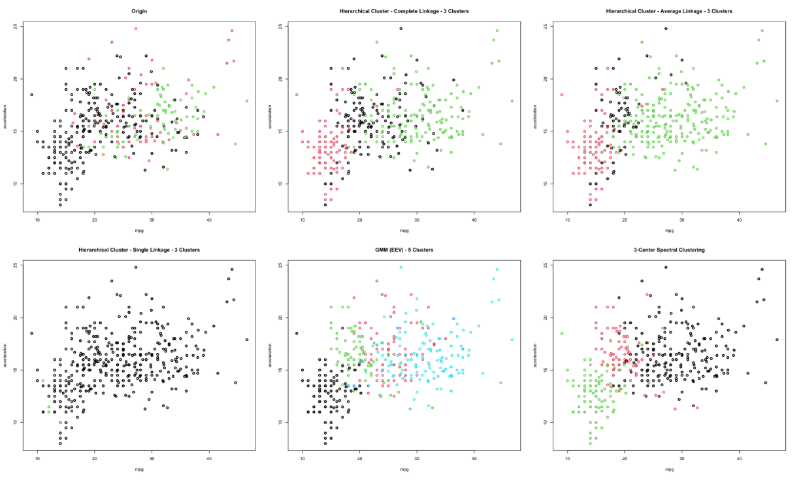

